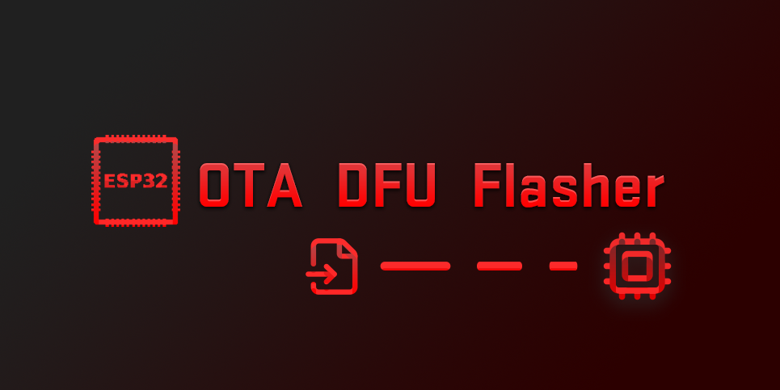
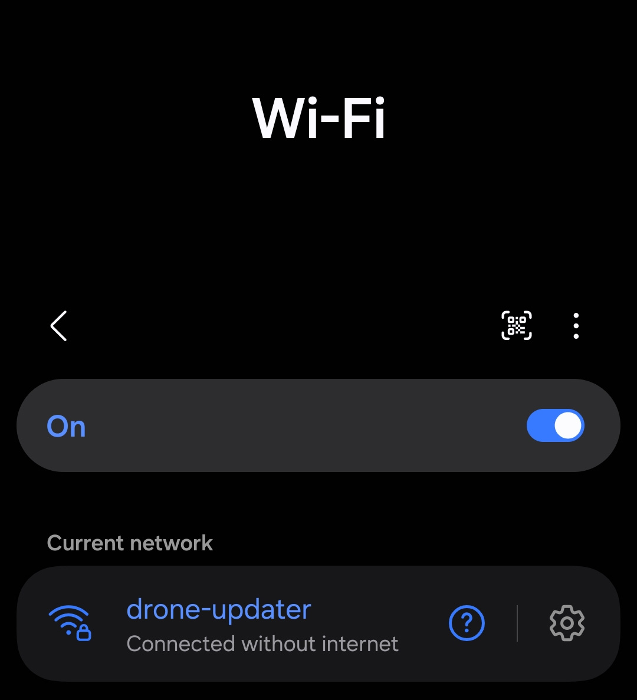
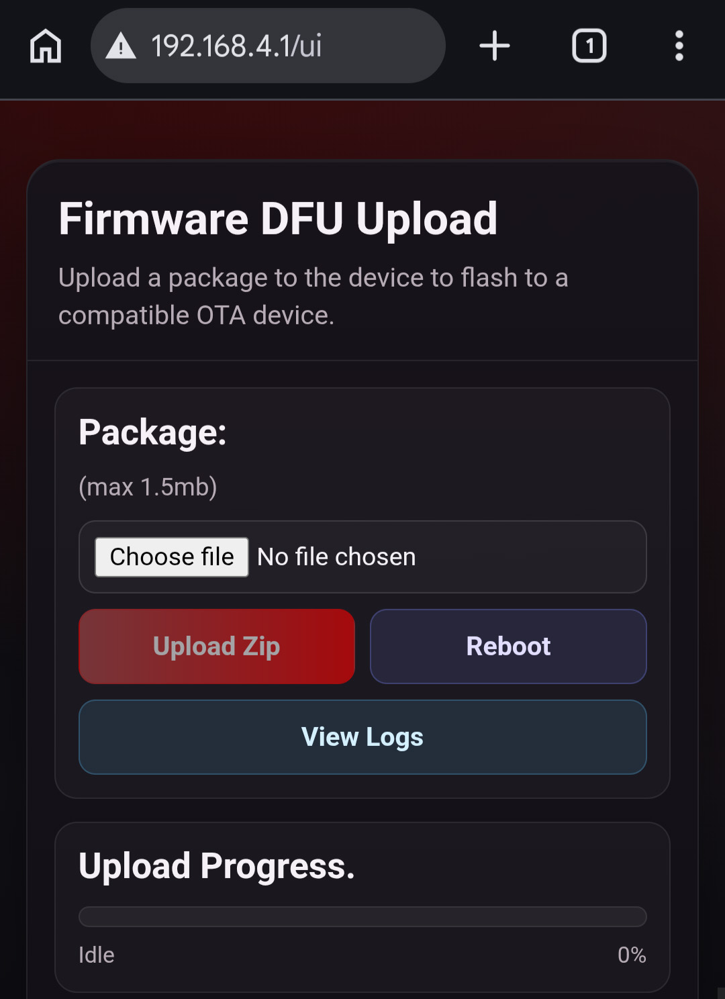
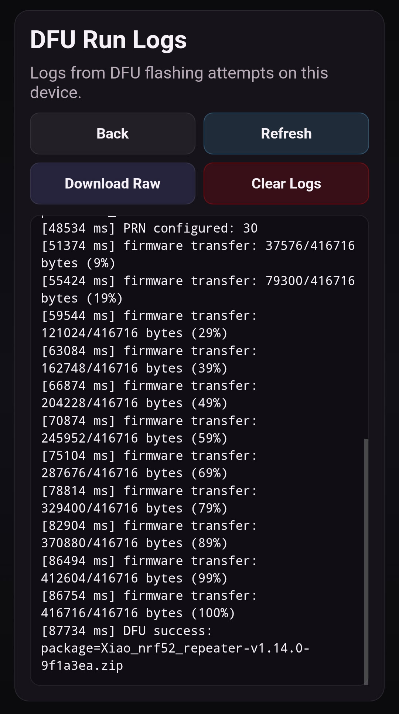

# ESP32 Nordic OTA DFU Uploader

ESP32 firmware package uploader + BLE DFU runner for Nordic OTA-compatible targets.

This release repo contains binaries and usage docs only.

## Latest Releases

Download the latest firmware artifacts from:

- https://github.com/cra0/esp32-nordic-ota-dfu/releases

Use a flasher such as ESPTool
- https://github.com/espressif/esptool/releases

## Flash Instructions

You can use esptool to flash the merged.bin firmware (which contains everything) into the target device like so:

`esptool.exe --chip esp32 --port COM12 write-flash 0x0 esp32\blecent-esp32-merged.bin`

Where chip sets the target chipset, port is the connected port and the path at the end points to the bin.

## What This Does

1. Creates a local Wi-Fi AP so you can upload a Nordic DFU `.zip` package.
2. Stores the package on the ESP32.
3. Reboots into BLE update mode and automatically scans for DFU targets.
4. Performs DFU and keeps logs you can review later from the web UI.

## Step 1: Connect to ESP32 AP

On your phone, connect to:

- SSID: `drone-updater`
- Password: `meshcore123`

## Step 2: Open the Upload UI

Open this URL in your browser:

- `http://192.168.4.1/ui`

## Package Upload Workflow

1. Tap **Choose file** and select your Nordic DFU `.zip`.
2. Tap **Upload Zip**.
3. Wait for upload + package validation to complete.
4. After a valid package is present:
   - **Upload Zip** is hidden.
   - **Delete Package** appears.
   - **Reboot to BLE** appears.

### Buttons in AP UI

- **Upload Zip**: uploads and validates the package.
- **Delete Package**: removes the stored package.
- **Reboot / Reboot to BLE**:
  - With valid package: reboots into BLE DFU mode.
  - Without package: normal reboot.
- **View Logs**: opens detailed run history.

## View Flash Logs Later

From `/ui`, tap **View Logs** (or open `/logs`) to inspect previous DFU runs.

You can:

- read the latest logs,
- download raw logs,
- clear logs.

## Hardware Button Controls

The left button on the ESP32-C6 board supports short/long press behavior:

- **Single press (short)**:
  - In BLE mode: toggles scan pause/resume (when idle).
  - In AP mode: ignored.
  - During active BLE transfer/connection: ignored.
- **Long press (~2.5s)**:
  - Toggles next boot mode (AP <-> BLE),
  - then reboots immediately.
  - Ignored while a DFU transfer is in progress.

The reset button is always a hardware reboot.

## Recommended Operator Flow

1. Power on device.
2. Connect to AP and upload package.
3. Confirm status is healthy.
4. Tap **Reboot to BLE** (or long-press left button).
5. Let updater scan and flash.
6. Return to AP mode later when you need to change package or review logs.

## Notes

- AP credentials are fixed in this release:
  - SSID: `drone-updater`
  - Password: `meshcore123`
- BLE scanning and DFU are autonomous in BLE mode.
- If no valid package is present, device defaults to AP mode for upload.
